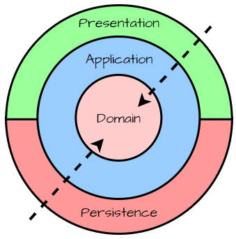

# Projeto Api Banco de Sangue

## Descrição do Projeto

Este projeto foi desenvolvido utilizando **Java 21** e visa processar dados de doares. Implementamos a **Clean
Architecture** para estruturar de forma organizada e desacoplada os diferentes módulos do projeto, garantindo facilidade
de manutenção e escalabilidade.

---

## Tecnologias Utilizadas

- **Java 21:** Linguagem de programação do projeto.
- **Spring Boot:** Framework Utilizado.
- **Spring Data JPA:** Framework para gerenciamento do banco de dados.
- **Spring MVC:** Biblioteca para desenvolvimento do serviço REST.
- **Lombok:** Biblioteca para reduzir boilerplate em classes Java ao automatizar a geração de getters, setters,
  construtores, etc.
- **Docker Compose Support (Spring):** Utilizado para integração simplificada entre o serviço e o banco de dados,
  eliminando a necessidade de configurações manuais complexas.
- **MySQL:** Banco de dados relacional utilizado no backend.
- **Gradle (com Gradlew):** Ferramenta de automação de build que simplifica a compilação, teste e execução do projeto.

---

## Arquitetura do Projeto



Este projeto foi desenvolvido utilizando os princípios da **Clean Architecture**, que organiza a aplicação em camadas,
separando responsabilidades para facilitar o entendimento do código e melhorar a manutenibilidade. Abaixo uma explicação
das principais camadas:

### Camadas Principais

1. **Entities (Domínio):**
    - Contém as regras de negócio e entidades fundamentais. Essa camada é independente de qualquer framework ou
      tecnologia.

2. **Use Cases:**
    - Implementa os casos de uso específicos do projeto. Aqui é onde a lógica do que a aplicação deve fazer é
      implementada.

3. **Interface Adapters:**
    - Faz a conversão de dados entre as camadas de domínio e as interfaces primárias (controllers, gateways). Por
      exemplo, transformar inputs HTTP em objetos de negócio.

4. **Infraestrutura:**
    - Contém as implementações de frameworks e serviços externos, como o repositório do banco de dados utilizando Spring
      Data JPA.

---

## Endpoints da API

A API expõe os seguintes endpoints:

---

## Endpoints Disponíveis

---

## Endpoints Disponíveis

### 1. **Buscar Compatibilidade por Tipo Sanguíneo**

- **URL:** `/public/api/blood-types/compatibility`
- **Método:** `GET`
- **Descrição:** Retorna a quantidade de possíveis doadores por tipo de sangue.
- **Exemplo de Resposta (JSON):**

  ```json
  [
    { "bloodType": "O-", "totalRecipient": 100 },
    { "bloodType": "O+", "totalRecipient": 200 },
    { "bloodType": "A-", "totalRecipient": 80 },
    { "bloodType": "A+", "totalRecipient": 120 }
  ]
  ```

---

### 2. **Listar Todos os Doadores**

- **URL:** `/public/api/donor/all`
- **Método:** `GET`
- **Descrição:** Retorna todos os doadores registrados no sistema.
- **Exemplo de Resposta (JSON):**

  ```json
  [
    {
      "name": "Milena Analu Pires",
      "birthDate": [1964, 5, 23],
      "gender": "Feminino",
      "number": 675,
      "city": "Teófilo Otoni",
      "state": "MG",
      "height": 1.53,
      "weight": 80,
      "bloodType": "O-"
    }
  ]
  ```

---

### 3. **Cadastrar Novo Doador**

- **URL:** `/public/api/donor/save`
- **Método:** `POST`
- **Descrição:** Cadastra um novo doador no sistema.
- **Body de Exemplo (JSON):**

  ```json
  [
    {
      "nome": "Milena Analu Pires",
      "cpf": "775.256.099-50",
      "rg": "44.084.541-5",
      "data_nasc": "23/05/1964",
      "sexo": "Feminino",
      "endereco": "Rua Kurt W. Rothe",
      "cidade": "Teófilo Otoni",
      "estado": "MG",
      "peso": 80,
      "tipo_sanguineo": "O-"
    }
  ]
  ```

- **Exemplo de Resposta (JSON):**

  ```json
  {
    "code": 201,
    "message": "Registered successfully"
  }
  ```

---

### 4. **Obter Média de Idade por Tipo Sanguíneo**

- **URL:** `/public/api/donor/yearAverage`
- **Método:** `GET`
- **Descrição:** Retorna a média de idade para cada tipo sanguíneo.
- **Exemplo de Resposta (JSON):**

  ```json
  [
    { "bloodType": "O-", "averageAge": 40.5 },
    { "bloodType": "O+", "averageAge": 35.7 }
  ]
  ```

---

### 5. **Quantidade de Doadores Acima do Peso**

- **URL:** `/public/api/donor/overweight`
- **Método:** `GET`
- **Descrição:** Retorna a quantidade de doadores acima do peso (obesos), separados por gênero.
- **Exemplo de Resposta (JSON):**

  ```json
  [
    { "gender": "Masculino", "total": 50 },
    { "gender": "Feminino", "total": 70 }
  ]
  ```

---

### 6. **IMC Médio por Faixa Etária**

- **URL:** `/public/api/donor/imcByAge`
- **Método:** `GET`
- **Descrição:** Retorna o IMC médio por faixa etária em intervalos de 10 anos.
- **Exemplo de Resposta (JSON):**

  ```json
  [
    { "ageRange": "20-30", "averageImc": 24.5 },
    { "ageRange": "30-40", "averageImc": 26.7 }
  ]
  ```

---

### 7. **Buscar Doadores por Estado**

- **URL:** `/public/api/donor/byState`
- **Método:** `GET`
- **Descrição:** Retorna os doadores cadastrados baseados no estado informado.
- **Parâmetro da URL:**
    - `state`: Sigla do estado (ex.: `SP`, `RJ`).

- **Exemplo de Resposta (JSON):**

  ```json
  [
    {
      "name": "Milena Analu Pires",
      "birthDate": [1964, 5, 23],
      "gender": "Feminino",
      "city": "São Paulo",
      "state": "SP",
      "bloodType": "A+"
    }
  ]
  ```

---

## Observações

- Todos os endpoints são **stateless** (sem sessões).
- Os dados transportados entre cliente e servidor utilizam o formato **JSON**.
- Baseado em **Spring MVC**, os serviços REST foram projetados para alto desempenho e simplicidade.
## Observações

- Todos os endpoints são **stateless** (sem sessões).
- Os dados transportados entre cliente e servidor utilizam o formato **JSON**.
- O projeto usa o **Spring MVC** para implementação do serviço REST, garantindo alto desempenho e simplicidade para consumir os endpoints.
 
## Executando o Projeto

### Pré-requisitos

- **Java 21:** Certifique-se de ter o Java 21 instalado na máquina.
- **Docker:** O Docker deve estar instalado para que o banco de dados seja iniciado automaticamente.

### Passos para Execução

1. Clone este repositório:
   ```bash
   git clone https://github.com/GuiParpineli/donors-api.git
   cd donors-api
   ```

2. Conceda permissão para o executável `gradlew` (caso necessário):
   ```bash
   chmod +x gradlew
   ```

3. Compile o projeto:
   ```bash
   ./gradlew build
   ```

4. Execute o projeto diretamente com Gradle:
   ```bash
   ./gradlew bootRun
   ```

---

### Banco de Dados com Docker

Este projeto utiliza **Spring Boot Docker Compose Support**, ou seja, quando o projeto é iniciado (via Gradle ou IDE), o
banco de dados MySQL é automaticamente inicializado em um contêiner Docker. Não é necessário executar configurações
adicionais para o banco de dados.

O Docker Compose está configurado no projeto para subir um contêiner MySQL com os seguintes detalhes:

- **Host:** `localhost`
- **Porta:** `3306`
- **Database:** `my_database`
- **Usuário:** `root`
- **Senha:** `verysecret`

Se desejar fazer conexões independentes com o banco de dados, certifique-se de que o Docker esteja em execução.

---

### Testando o Código

Para rodar todos os testes automatizados (se existentes), use:

```bash
./gradlew test
```

---

### Estrutura de Pacotes

Abaixo está um breve resumo da organização dos pacotes do projeto seguindo o modelo de Clean Architecture:

```plaintext
src/
├── domain/          # Regras de negócio e entidades
├── usecases/        # Casos de uso específicos
├── adapters/        # Adaptadores de interface (controladores, gateways)
├── infrastructure/  # Configurações e implementação de frameworks
```

---
